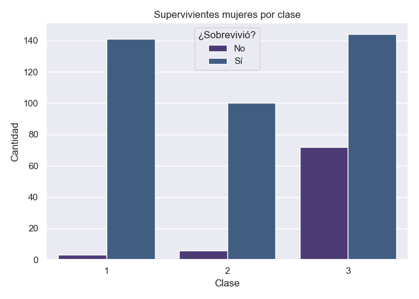
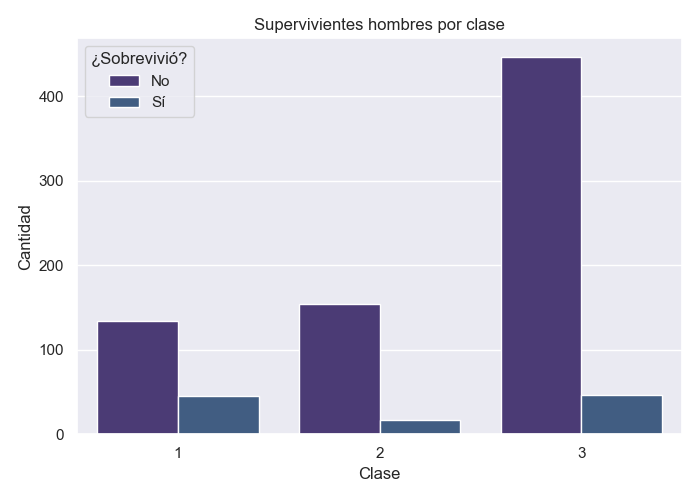
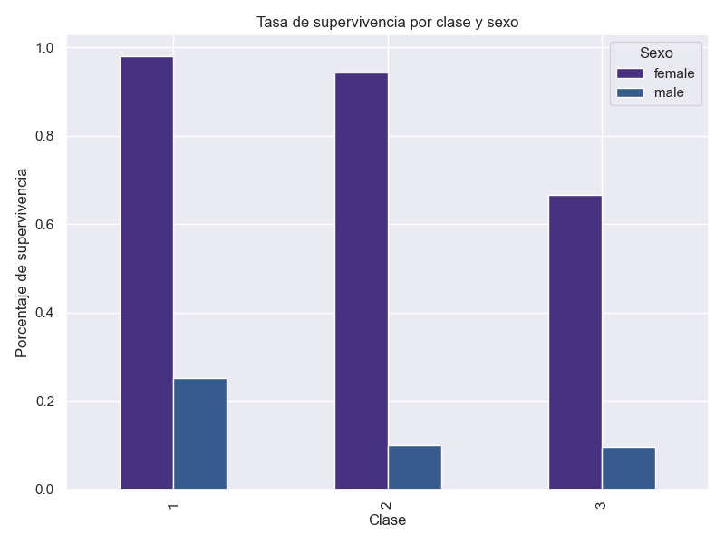

## Análisis de supervivencia por sexo y clase social

### 1. Distribución de mujeres y hombres por clase

Para analizar la distribución de género entre las clases sociales del Titanic, utilizamos una tabla de contingencia y un gráfico de barras:

```python
pd.crosstab(df['Pclass'], df['Sex'])
```

La gráfica muestra que la mayoría de los pasajeros de tercera clase eran hombres, mientras que en primera clase el número de mujeres es relativamente mayor comparado con las otras clases.

---

### 2. Sobrevivientes por clase y sexo

Tablas de sobrevivientes:

```python
pd.crosstab([df['Pclass'], df['Sex']], df['Survived'])
```

Gráficos de supervivencia por sexo y clase:
Mujeres:

Hombres:

---

### 3. Porcentaje de supervivencia por clase y sexo

Calculamos el porcentaje de supervivencia usando groupby:

```python
df.groupby(['Pclass', 'Sex'])['Survived'].mean().unstack()
```

Y lo visualizamos en un gráfico de barras:



---

### 4. Conclusión

Según los análisis realizados, la mayoría de las personas que sobrevivieron al hundimiento del Titanic fueron mujeres. Además, los porcentajes de supervivencia fueron notablemente mayores en las clases sociales altas (primera clase), tanto para mujeres como para hombres. Esto refleja el conocido patrón de “mujeres y niños primero” y también evidencia el privilegio que tuvieron los pasajeros de mayor estatus socioeconómico durante el rescate.

Los gráficos muestran que la proporción de supervivientes mujeres supera ampliamente a la de los hombres en todas las clases.

En primera clase, la supervivencia fue la más alta, especialmente para mujeres.

En tercera clase, tanto hombres como mujeres tuvieron menor probabilidad de sobrevivir.

Autor: Diego González — EDA Titanic 2025
