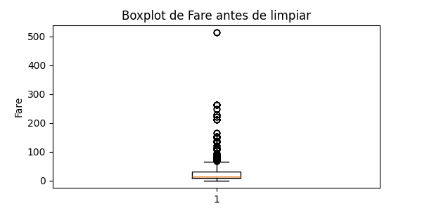
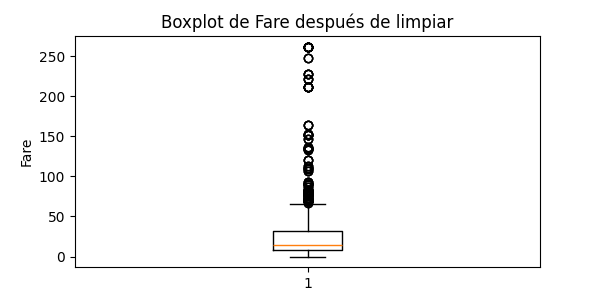

# Preprocesamiento y limpieza de datos: Titanic

Este documento resume el proceso de limpieza y preprocesamiento realizado sobre el dataset del Titanic, con el objetivo de dejar los datos listos para su análisis y modelado en machine learning.

---

## 1. Carga y análisis inicial del dataset

```python
import pandas as pd
df = pd.read_csv("Fase1_Data_Scientist_Junior/Modulo2_numpypandas/train.csv")
print(df.describe())
print(df.isnull().sum())
```

Se analiza la cantidad de valores nulos y las estadísticas principales de cada columna.

---

## 2. Tratamiento de valores nulos

* 'Age' y 'Fare' presentan valores nulos.
* Se llenan los nulos con la mediana, que es robusta frente a outliers.

```python
df['Age'] = df['Age'].fillna(df['Age'].median())
df['Fare'] = df['Fare'].fillna(df['Fare'].median())
```

---

## 3. Eliminación de columnas irrelevantes

Se eliminan las columnas 'Cabin' y 'Ticket' porque tienen demasiados nulos o no aportan valor directo para el análisis/modelado inicial.

```python
df = df.drop(['Cabin', 'Ticket'], axis=1)
```

---

## 4. Codificación de variables categóricas

Se codifican las variables 'Sex' y 'Embarked' usando one-hot encoding.

```python
df = pd.get_dummies(df, columns=['Sex', 'Embarked'], drop_first=True)
```

---

## 5. Eliminación de duplicados

```python
df = df.drop_duplicates()
```

Se eliminan filas duplicadas para evitar sesgos en el análisis/modelado.

---

## 6. Escalado de variables numéricas

```python
from sklearn.preprocessing import StandardScaler
scaler = StandardScaler()
df[['Age', 'Fare']] = scaler.fit_transform(df[['Age', 'Fare']])
```

Se escalan 'Age' y 'Fare' usando StandardScaler.

---

## 7. Análisis de outliers en 'Fare' (opcional)

Se grafican boxplots de 'Fare' antes y después de recortar los valores extremos (por encima del percentil 99):

```python
import matplotlib.pyplot as plt
import numpy as np

# Boxplot de 'Fare' antes de limpiar outliers
plt.figure(figsize=(6, 3))
plt.title('Boxplot de Fare antes de limpiar')
plt.boxplot(df['Fare'].dropna())
plt.ylabel('Fare')
plt.show()

# Recorte de outliers en 'Fare'
q99 = df['Fare'].quantile(0.99)
df['Fare'] = np.where(df['Fare'] > q99, q99, df['Fare'])

# Boxplot de 'Fare' después de limpiar outliers
plt.figure(figsize=(6, 3))
plt.title('Boxplot de Fare después de limpiar')
plt.boxplot(df['Fare'].dropna())
plt.ylabel('Fare')
plt.show()
```

### Visualización de los boxplots




---

## 8. Conclusiones

* Se trataron los valores nulos en 'Age' y 'Fare' usando la mediana.
* Se eliminaron columnas poco útiles ('Cabin', 'Ticket').
* Se codificaron variables categóricas y se eliminaron duplicados.
* Se escalaron las variables numéricas para facilitar el modelado.
* Se realizó un análisis visual de outliers en 'Fare'.

El dataset está ahora **listo para análisis avanzados y para ser usado en modelos de Machine Learning**.

---

*Autor: Diego González — Preprocesamiento Titanic 2025*
