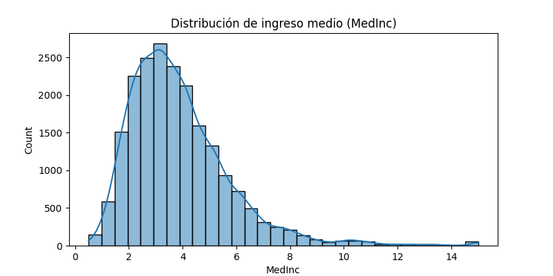
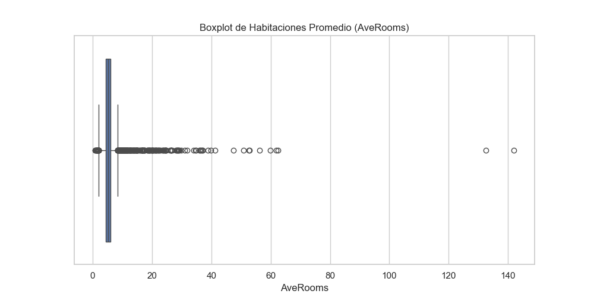
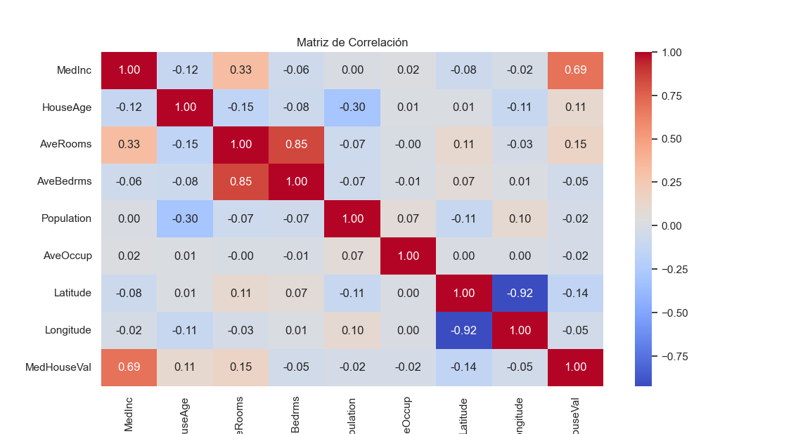

# Mini-reporte EDA: California Housing

---

## 1. Descripción General del Dataset

Este análisis exploratorio se realizó sobre el dataset "California Housing". El objetivo es conocer la estructura, distribución y relaciones clave entre variables numéricas para futuras tareas de modelado.

---

## 2. Estadísticas Descriptivas

* **Medidas principales:** media, mediana, moda, desviación estándar, mínimos y máximos.
* **Variables numéricas analizadas:**

  * Ingreso medio (MedInc)
  * Edad promedio de la vivienda (HouseAge)
  * Promedio de habitaciones (AveRooms)
  * Promedio de dormitorios (AveBedrms)
  * Población total (Population)
  * Ocupación promedio (AveOccup)
  * Valor medio de la vivienda (MedHouseVal)

---

## 3. Visualizaciones clave

* Histograma y boxplot de **MedInc** (Ingreso medio)
* Histograma y boxplot de **HouseAge** (Antigüedad de vivienda)
* Boxplot de **AveRooms**
* Matriz de correlación entre variables
* Scatterplot entre Ingreso medio y Valor de vivienda

---

## 4. Insights clave del análisis

1. **Antigüedad de la vivienda (`HouseAge`)**: La mayoría de las viviendas tienen entre 10 y 40 años (mediana ≈ 29 años). Distribución relativamente uniforme y sin outliers extremos claros.

2. **Promedio de habitaciones (`AveRooms`)**: Promedio cerca de 5 habitaciones por hogar, pero existen algunos outliers (>20 habitaciones), lo que puede indicar viviendas excepcionales o errores de muestreo.

3. **Correlaciones destacadas**: Alta correlación positiva entre ingreso medio (`MedInc`) y valor medio de la vivienda (`MedHouseVal`). También es notable la relación entre `AveRooms` y `AveBedrms`, que era esperable.

4. **Outliers y asimetría**: Población (`Population`) y ocupación promedio (`AveOccup`) muestran asimetría y algunos valores extremos en la cola derecha.

---

## 5. Conclusión

El dataset presenta variables bien distribuidas, aunque existen outliers en habitaciones, población y ocupación promedio. El ingreso medio es un fuerte predictor del valor de la vivienda. Estos insights son útiles para futuras tareas de modelado y selección de variables.

---

*Autor: Diego González — Mini-reporte EDA Housing 2025*
