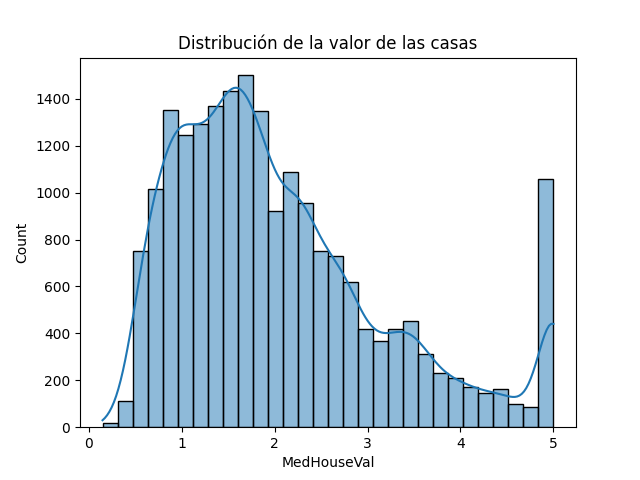
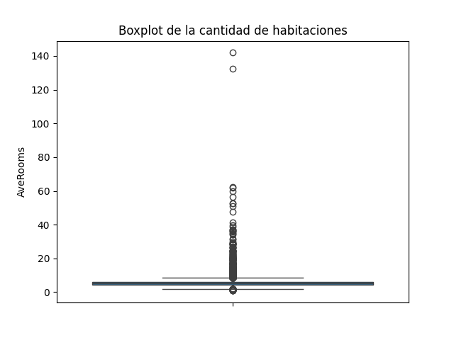
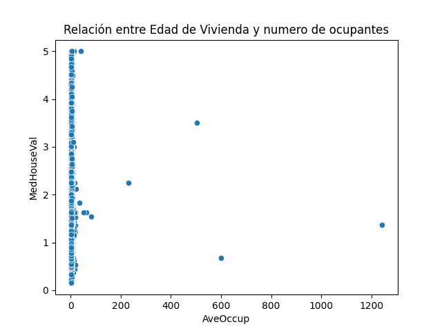

# Análisis de Datos – Clase 7.3

## 1️⃣ Histograma de `MedHouseVal`

- **Observación:** La mayoría de los valores se concentran entre 1 y 2.  
- **Valores altos:** Aunque son pocos, hay un **pico notable alrededor del valor 5**.  
- **Interpretación:** Los valores altos son poco frecuentes y reflejan un límite o “tope” en los valores de las casas.

---

## 2️⃣ Boxplot de `AveRooms`

- **Observación:** La mayoría de las propiedades tienen un número promedio de habitaciones dentro de un rango normal.  
- **Valores extremos:** Existen algunas propiedades con un **número inusualmente alto de habitaciones** (outliers).  
- **Interpretación:** Estas propiedades podrían ser casas grandes o complejos residenciales, excepcionales frente a la mayoría de la muestra.

---

## 3️⃣ Scatterplot entre `AveOccup` y `MedHouseVal`

- **Observación:** La mayoría de los puntos se agrupan cerca del eje Y, donde `AveOccup` es muy bajo.  
- **Relación:** No se observa una **correlación clara** entre el número promedio de ocupantes y el valor de la casa.  
- **Interpretación:** El número promedio de ocupantes no influye directamente en el valor de la vivienda según este análisis.

---

## ✅ Conclusión general

- La variable `MedHouseVal` muestra **valores altos poco frecuentes**, con un pico máximo significativo.  
- `AveRooms` presenta **algunas propiedades excepcionales** con muchas habitaciones.  
- `AveOccup` **no parece afectar directamente** al valor de la vivienda.  
